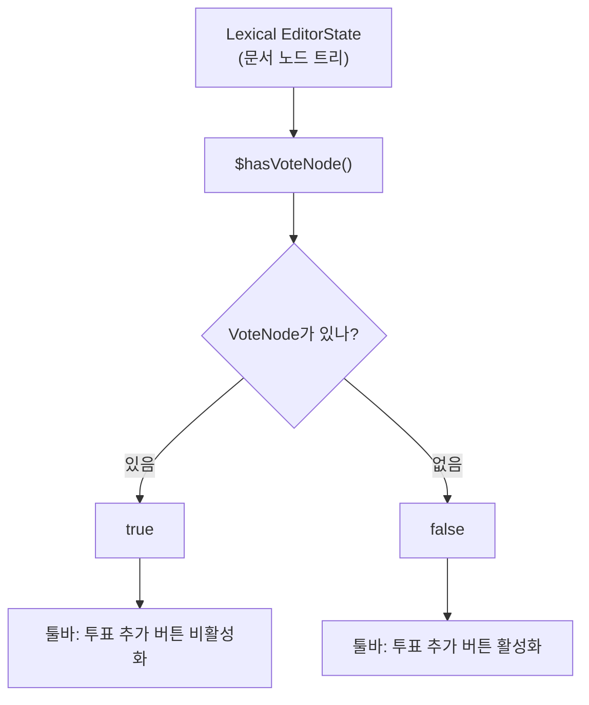
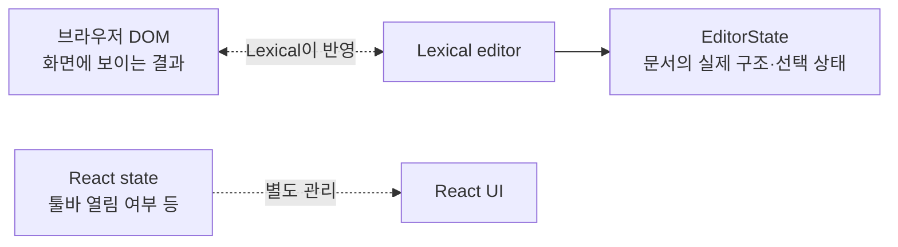
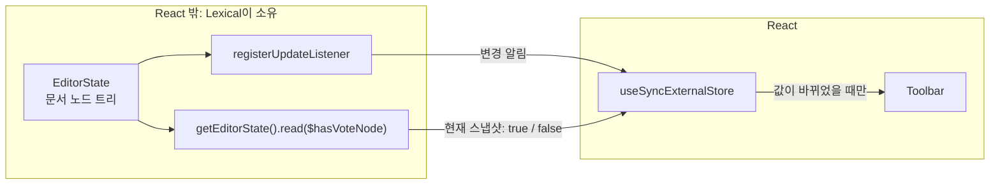
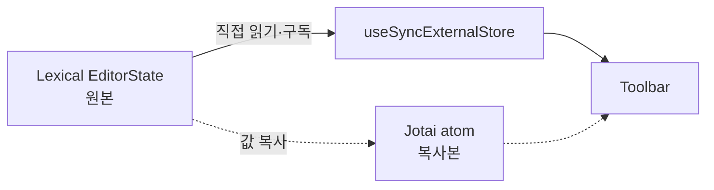
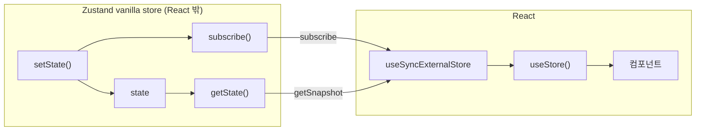

에디터 툴바에 “투표가 이미 있으면 투표 버튼을 비활성화한다.”

<!--more-->

툴바에서 직접 투표 상태를 관리하는 것이 아니라 Lexical 에디터의 노드 트리에서 VoteNode가 있는지 읽어야 하는 상황

```tsx
// 현재 문서에 VoteNode가 하나라도 있는지 ?!
function $hasVoteNode(): boolean {
  return $getRoot()
    .getChildren()
    .some((child) => $isVoteNode(child));
}
```



여기서 true/false는 Lexical의 `EditorState`를 확인하고 결과를 알려주는 것이다

<details markdown="1">
<summary>그렇다면 Lexical의 <code>EditorState</code>는 무엇인가 ?!</summary>

에디터 문서의 전체 상태, 문서 구조와 커서, 선택 상태까지 포함한 Lexical의 상태 모델

!image.png

이런식으로 트리 구조가 담겨 있습니다

커서가 무엇을 선택했는지 어떤 스타일이 적용되어 있는지 다 정의하고 있는

그리고 `EditorState`는 상태를 읽기 전용 스냅샷으로 제공합니다

```tsx
const editorState = editor.getEditorState();

editorState.read(() => {
  const hasVote = $hasVoteNode();
});
```

- `editor`: 지금 동작 중인 Lexical 에디터 그 자체
- `editor.getEditorState()`: 현재 시점의 문서 상태 가져오기
- `editorState.read(..)`: 그 안의 노드 트리 조회하기
- `$hasVoteNode()` : 조회 중인 트리에 VoteNode 있는지 검사



</details>

## 기존 방식: 외부 값을 state에 복사하기

```tsx
const [editor] = useLexicalComposerContext();
const [isVoteExist, setIsVoteExist] = useState(false);

useEffect(() => {
    // 현재 포스트에 투표 노드가 있는지 먼저 확인
  setIsVoteExist(editor.getEditorState().read($hasVoteNode));
    
  return editor.registerUpdateListener(({ editorState, dirtyElements }) => {
  // 문서가 변경될 때마다 실행되는 listener 등록하기
  
    if (dirtyElements.size === 0) return;  // 문서 구조 안바뀌면 무시
        
        // 변경된 문서 상태에서 투표 노드 존재 여부 다시 검사
    const next = editorState.read($hasVoteNode);
    
    // 이전 상태와 검사 결과가 같으면 기존 값 그대로 반환
    // 다르면 새 값을 반환해서 Toolbar 다시 그리기
    setIsVoteExist((prev) => (prev === next ? prev : next));
  });
}, [editor]);
// editor가 바뀌면 이전 listener 해제하고 새로 구독
```

1. 현재 외부 값 읽기
    - Lexical에서 투표 존재 여부를 읽어 state에 저장
2. 외부 값이 바뀌는 시점 구독하기
    - 이후 에디터가 바뀌면, 문서 구조가 바뀐 경우에만 다시 검사
3. 이전 값과 비교해 다를 때 React 다시 렌더링하기
    - 투표 존재 여부가 이전과 달라졌을 때만 툴바 다시 그리기

⇒ 이걸 제공하는 훅이 바로 React의 useSyncExternalStore

## `useSyncExternalStore` 사용해서 리팩토링하기

useSyncExternalStore는 React 밖에서 관리되는 데이터를 React 화면에 연결하는 훅

React 밖이라는 말은 말 그대로 React가 소유하지 않은 데이터

React에서 useState로 관리해야 react가 소유한 데이터

```tsx
const value = useSyncExternalStore(
  subscribe,         // “값이 바뀌면 알려줘”
  getSnapshot,       // “지금 값이 뭐야?”
  getServerSnapshot, // “서버 렌더링에서는 어떤 값이야?” (선택)
);
```

이렇게 3가지 인자를 받고 있다.

- `subscribe`: 외부 스토어 변경을 감지하고 react에게 알리는 함수
- `getSnapshot`: 현재 외부 값을 동기적으로 반환하는 함수

```tsx
const subscribe = useCallback(
  (onStoreChange: () => void) =>
    editor.registerUpdateListener(({ dirtyElements }) => {
      if (dirtyElements.size === 0) return;
      onStoreChange();
    }),
  [editor],
);

const getSnapshot = useCallback(
  () => editor.getEditorState().read($hasVoteNode),
  [editor],
);

const isVoteExist = useSyncExternalStore(subscribe, getSnapshot);
```

여기서의 ExternalStore는 우리 에디터의 EditorState를 말한다



### subscribe

react에게 바뀌면 알려주기

```tsx
const subscribe = (onStoreChange) =>
  editor.registerUpdateListener(() => {
      if (dirtyElements.size === 0) return;
    onStoreChange();
  });
```

여기서 react가 `onStoreChange`를 넘겨주는데 Lexical이 변경됐을 때 이 함수를 호출하면 되는거다 !

`dirtyElements`는 이번 에디터 업데이트에서 변경된 노드 목록이라서 size가 0이면 이번 변경에서 문서 요소 구조가 바뀐게 없으니 투표 존재 여부 다시 검사 X 를 의미한다

<details markdown="1">
<summary>subscribe에서는 구독 해제 함수를 반드시 반환해야 하는데 <code>editor.registerUpdateListener</code> 자체가 구독 해제 함수를 반환해준다.</summary>

```tsx
class LexicalEditor {
  _listeners = {
    update: new Map(),
    // 다른 종류의 listener도 생략되어 있음
  };

  registerUpdateListener(listener: UpdateListener): () => void {
    return registerListener(this._listeners.update, listener);
  }
}
```

Lexical에서는 위와 같이 registerUpdateListener를 정의하고 있고

여기서 사용하는 registerListener는 다음과 같이 정의하고 있다

```tsx
function unregisterListener<T>(listenerMap: ListenerMap<T>, listener: T): void {
  const unregister = listenerMap.get(listener);
  listenerMap.delete(listener);
  if (unregister) {
    unregister();
  }
}

function registerListener<T>(
  listenerMap: ListenerMap<T>,
  listener: T,
  unregister?: undefined | (() => void),
): () => void {
  listenerMap.set(listener, unregister);
  return unregisterListener.bind(null, listenerMap, listener);
}
```

`return unregisterListener.bind(null, listenerMap, listener);`

이 부분이 구독해제 역할을 하고 있다

</details>

### getSnapshot

```tsx
const getSnapshot = () => editor.getEditorState().read($hasVoteNode);
```

현재 포스트에 투표가 있는가(true) 없는가(false)

위에서 구독한 걸로 변경 알림을 받으면 getSnapshot을 호출하고 이전 값과 새로운 값을 Object.is 로 비교한다.

기존 코드의 `setIsVoteExist((prev) => (prev === next ? prev : next));` 부분을 react가 대체하는 거

### 프로젝트에서 jotai를 사용하여 상태를 관리하고 있는데 왜 여기서는 jotai를 사용하지 않았는가 ?

투표 노드가 존재하는가에 대한 원본 값은 Lexical에 있으니까 



이런식으로 jotai로 구현할 수 있지만,,, 에디터 변경을 감지해서 atom에 값을 연결해주는 작업이 필요하다. 그렇게 되면 중간 저장소가 하나 더 생겨버린다

그리고 jotai는 useSyncExternalStore를 사용하지 않고 useReducer를 사용해서 상태를 관리하고 있다. https://github.com/pmndrs/jotai/discussions/2137

여기 discussion을 보면 tearing 방지와 Promise/Suspense , useTransition 호환성 사이의 트레이드오프 때문이라고 했다.  

### 그렇다면 Zustand는 어떻게 사용할까

zustand에서는 useSyncExternalStore를 사용하고 있어서 어떻게 사용하고 있는지 찾아봤다

https://github.com/pmndrs/zustand/blob/main/src/react.ts

```tsx
{
  getState,   // 현재 상태 읽기
  subscribe,  // 변경 구독
  setState,   // 상태 변경
}

function useStore(api, selector = (state) => state) {
  return useSyncExternalStore(
    api.subscribe,
    () => selector(api.getState()),
    () => selector(api.getInitialState()),
  );
}
```



Zustand 스토어는 React 밖에 있고 이를 React의 useSyncExternalStore에 연결한다

Jotai는 아니지만 useSyncExternalStore를 사용한 작업이 Zustand와 유사하다

| 역할 | Lexical 투표 상태 | Zustand |
| --- | --- | --- |
| 외부 스토어 | `EditorState` | Zustand store |
| 구독 | `editor.registerUpdateListener` | `api.subscribe` |
| 현재값 읽기 | `editor.getEditorState().read($hasVoteNode)` | `api.getState()` |
| React 연결 | `useSyncExternalStore` | `useSyncExternalStore` |

이 리팩토링 작업의 핵심은

> React가 소유하지 않은 Lexical의 EditorState를 복사하지 않고, 화면에 직접 연결했다 !
> 
- Lexical이 문서 트리의 원본을 관리
- subscribe가 Lexical의 변경을 React에 알리기
- getSnapshot으로 현재 투표 존재 여부 읽기
- React가 이전과 현재 snapshot을 비교해 필요한 경우에만 툴바 다시 그리기
