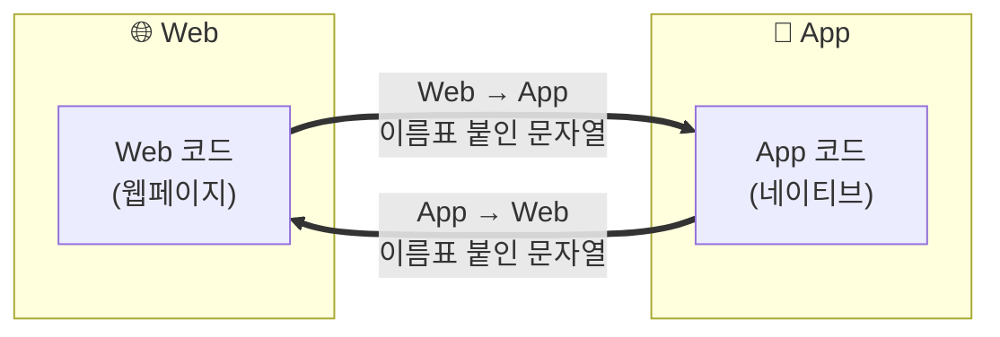
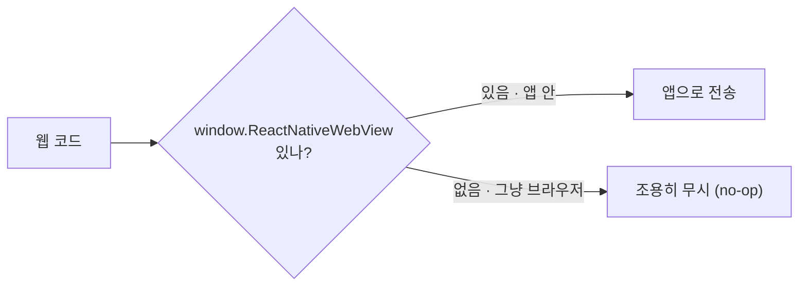
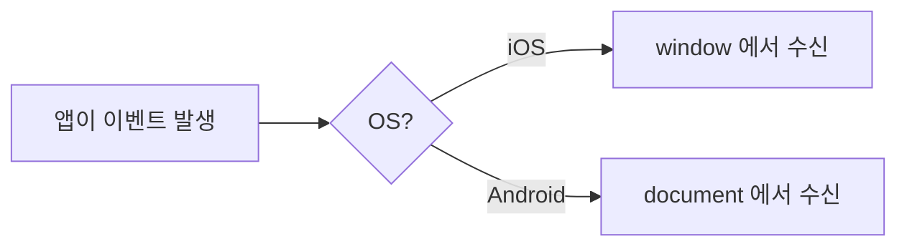
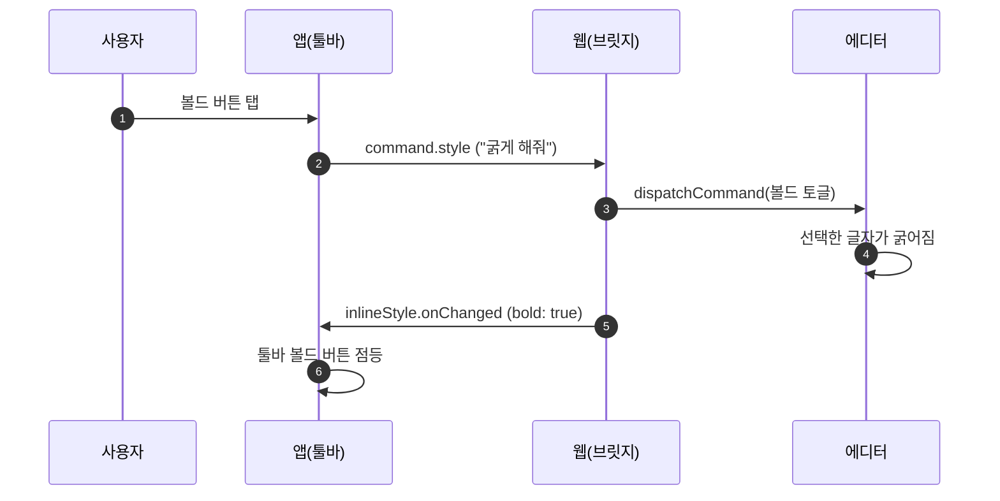

앱 안에 글쓰기 화면이 웹뷰로 떠 있는 상황.

<!--more-->

- 글씨를 굵게 처리하고 싶으면
  - App에서 Web으로 굵게 처리하는 명령을 보내고
- 커서가 굵은 글씨 위에 있으면
  - Web이 App에게 bold 처리 상태라는 명령을 보낸다

서로의 상황을 끊임없이 주고받는 상태이고, 이걸 담당하는 게 **브릿지 코드**다.



## 브릿지 코드의 2가지 규칙

### 1️⃣ 반드시 문자열이어야 한다

앱과 웹 사이의 통로는 오직 문자열(text)만 통과시킨다. 객체를 그대로 못 보내기 때문이다. 그래서 보낼 때 `JSON.stringify()`(직렬화)로 문자열로 바꾸고, 받는 쪽에서 `JSON.parse()`(역직렬화)로 다시 객체로 되돌린다.

```
{
    볼드 켜짐: 예
    글자 색: 검정
}
```

- **역직렬화**: 받은 글을 다시 원래 모양으로 돌리기 ⬅️
- **직렬화**: 구조가 있는 데이터를 한 줄의 글자로 펴기 ➡️

```json
{ "볼드": "예", "글자색": "검정" }
```

> 💡 **왜 문자열만 되나?** 웹뷰의 통신 채널은 네이티브(앱)와 웹이라는 서로 다른 실행 환경을 이어주는 아주 얇은 파이프다. 이 파이프는 언어 중립적인 문자열만 안전하게 나를 수 있다.

얇은 파이프가 된 이유는 OS가 처음부터 이 통로를 문자만 통과할 수 있도록 설계했기 때문이다. 문자는 어느 언어나 다 알아듣는 유일한 장치이기 때문에 이렇게 설정한 것이다.

### 2️⃣ 이름표를 붙인다

메시지마다 "이게 무슨 메시지인지"를 나타내는 이름표를 만든다.

```jsx
{ name: "command.style", body: { style: "bold" } }
```

`name`이 이름표(무슨 메시지인지), `body`가 내용물이다. 받는 쪽은 이 `name`을 보고 "아, 굵게 처리하라는 명령이구나" 하고 알맞은 처리를 한다.

## 방향 1: 웹 → 앱

웹이 앱에게 말을 걸 때는(예: "커서가 굵은 글씨 위에 있어"라고 알릴 때), 앱이 웹 안에 미리 심어둔 우편함을 쓴다.

```jsx
window.ReactNativeWebView.postMessage(
  JSON.stringify({ name: "inlineStyle.onChanged", body: { bold: true } }),
);
```

`window.ReactNativeWebView`는 원래 브라우저에 없는 객체다. 앱이 웹뷰를 띄우면서 웹 안에 몰래 끼워 넣어준 객체다. 그래서 이 웹페이지를 그냥 PC 브라우저로 열면 이 객체가 없다.

웹 코드는 웹뷰 안에서도, 일반 브라우저에서도 돌아갈 수 있어야 하니까 보통 이렇게 방어한다.

```jsx
function postToApp(name, body) {
  if (!window.ReactNativeWebView) return; // 앱 밖이면 조용히 무시
  window.ReactNativeWebView.postMessage(JSON.stringify({ name, body }));
}
```

이 `if` 한 줄 덕분에 같은 코드가 **앱에서는 브릿지로** 동작하고, 브라우저에서는 에러 없이 그냥 넘어간다.



## 방향 2: 앱 → 웹

반대로 앱이 웹에게 메시지를 보낼 때는, 앱이 웹 안에서 자바스크립트를 실행시켜 이벤트를 하나 발생시킨다. 웹은 그 이벤트를 듣고 있다가 받는다.

```jsx
// 앱이 웹 안에서 실행시키는 코드 (개념 예시)
window.dispatchEvent(new MessageEvent("message", { data: "메시지 내용" }));
```

```jsx
// 웹 쪽 수신부
window.addEventListener("message", (event) => {
  const msg = JSON.parse(event.data);
  // msg.name 보고 처리
});
```

iOS에서는 `window`에서 듣고, Android에서는 `document`에서 들어야 한다.

```jsx
if (isAndroid) {
  document.addEventListener("message", handler); // 안드로이드
} else {
  window.addEventListener("message", handler); // iOS
}
```



### 왜 iOS는 window, Android는 document일까

#### 1️⃣ 애초에 따로 만들었다 (진짜 뿌리)

React Native 웹뷰 라이브러리는 하나처럼 보이지만, 속을 열어보면 **iOS와 Android 구현이 완전히 별개**다.

- iOS는 `WKWebView`(애플이 만든 웹뷰)를 **Swift/Objective-C**로 감싸고
- Android는 `WebView`(구글이 만든 웹뷰)를 **Java/Kotlin**으로 감싼다

앱→웹으로 메시지를 넣는 코드도 플랫폼마다 따로 작성된다.

```jsx
// iOS 담당자가 짠 주입 코드
window.dispatchEvent(new MessageEvent("message", { data }));

// Android 담당자가 짠 주입 코드
document.dispatchEvent(new MessageEvent("message", { data }));
```

보다시피 하는 일은 똑같은데 **대상만 iOS는 `window`, Android는 `document`**로 다르다. 두 코드를 각기 다른 사람이 짜면서 "어디다 던질까"를 각자 편한 대로 정했고, **서로 맞춰야 한다는 합의 없이** 그대로 릴리스된 것이다.

이거를 갑자기 통일시켜버리면 남들 코드가 망가지니 못 고치게 된다. → **"하위호환의 저주"** 형태.

#### 2️⃣ Android가 하필 document를 고른 데는 그럴듯한 이유가 있다

핵심은 **`window`는 이미 `message` 이벤트를 쓰고 있다**는 점이다.

브라우저 표준 API 중에 `window.postMessage`가 있다. iframe이나 다른 탭/창과 통신할 때 사용한다. 예를 들어 페이지에 광고 iframe이 있고, 그 iframe이 부모에게 메시지를 보내면:

```jsx
// 광고 iframe 코드
window.parent.postMessage({ type: "ad-loaded" }, "*");
```

이 메시지는 부모 페이지의 **`window`의 `"message"` 이벤트**로 도착한다:

```jsx
window.addEventListener("message", (e) => {
  // e.data = { type: "ad-loaded" }  ← 광고 iframe이 보낸 것
});
```

즉 `window`의 `"message"`는 **원래 iframe·크로스윈도우 통신용으로 이미 예약된 채널**이다.

**여기에 앱까지 끼어들면?** 만약 Android 브릿지도 앱→웹 메시지를 `window`의 `"message"`로 쏜다면, 웹의 리스너 하나가 **두 종류를 다 받게** 된다.

```jsx
window.addEventListener("message", (e) => {
  // e.data 가 광고 iframe이 보낸 건지?
  // 아니면 네이티브 앱이 보낸 건지?
  // → 구분하려면 매번 검사해야 함
});
```

출처가 섞여서, 매번 "이게 앱 메시지인가 iframe 메시지인가"를 필터링해야 하는 문제가 발생한다.

**그래서 `document`.** 반면 `document`에는 이런 표준 `"message"` 이벤트가 **오지 않는다.** iframe 통신은 `window`로만 가지 `document`로는 가지 않는다. 그래서 Android는 `document`를 앱 전용 통로로 사용한다.

```jsx
document.addEventListener("message", (e) => {
  // 여기 오는 건 오직 네이티브 앱이 보낸 것뿐. 섞일 걱정 없음.
});
```

출처가 하나로 보장되니 필터링도 필요 없고 깔끔하게 작성 가능하다.

> iOS 웹뷰는 앱↔웹 통신을 `window.webkit.messageHandlers`라는 **아예 별도 채널**로 처리해서, `window`의 `"message"`를 써도 iframe 메시지와 섞일 구조가 아니다.

## inbound와 outbound의 역할

앱과 웹이 똑같은 메시지 이름 목록을 공유한다. "이 이름표엔 이런 내용물이 담긴다"를 한 곳에 정의해두고 양쪽이 그대로 따르는 것이다. 이 약속만 지키면 앱과 웹이 서로 몰라도 통신이 잘 된다.

방향별 통역사. 들어오는 명령(앱→웹)과 나가는 상태(웹→앱)를 파일이나 모듈로 나눠둔다. `inbound`(들어옴) / `outbound`(나감)라고 네이밍한다.

- `inbound`: 앱에서 온 "굵게 해줘" 같은 명령을 받아 실제 에디터를 조작
- `outbound`: 에디터의 현재 상태("지금 굵게 켜져 있음")를 계산해 앱에 알릴 형태로 변환

브릿지 자체는 교통정리만 하고, 실제 일은 통역사에게 넘기는 구조라 코드가 훨씬 깔끔해진다.

## 볼드 하나에도 두 종류의 메시지가 오간다

- **명령 (앱 → 웹)**: 사용자가 툴바 볼드 버튼을 누르면, 앱이 웹에 "선택한 글자 굵게 해줘"라고 시킨다. 답을 기다리지 않는 일방적 지시.
- **상태 알림 (웹 → 앱)**: 커서가 굵은 글씨 위로 가면, 웹이 앱에 "지금 여긴 볼드야"라고 알려준다. 앱이 물어봐서가 아니라, 웹이 상태가 바뀔 때마다 알아서 보내는 메시지.

명령엔 실제 처리 담당(통역사)이 붙는다. `command.style` 명령이 오면 `inbound` 통역사가 에디터에게 진짜 볼드를 실행시킨다.

```jsx
// inbound: 앱의 "굵게 해줘"를 받아 실제 에디터를 조작
function applyInlineFormat(editor, style) {
  editor.dispatchCommand(FORMAT_TEXT_COMMAND, style); // 선택 영역에 볼드 토글
}
```

브릿지는 "굵게 해줘"라는 말을 전달만 하고, 실제로 글자를 굵게 만드는 건 에디터 엔진의 몫이다. 통신과 편집이 깔끔히 나뉘는 구조다.

## 볼드 한 번의 여정



1. 사용자가 툴바 볼드 버튼을 누른다 → 앱이 웹에 `command.style`(bold)을 보낸다
2. 웹의 통역사가 에디터에게 볼드 토글을 실행시킨다 → 선택한 글자가 실제로 굵어진다
3. 웹이 "이제 볼드 켜졌어"를 `onChanged`로 되쏜다 → 앱이 툴바 볼드 버튼을 켠다

<br/>

---

<br/>

## 요약

- 앱과 웹은 **문자열 쪽지**를 주고받는다. 쪽지엔 **이름표(`name`)**가 붙는다.
- 웹→앱은 `window.ReactNativeWebView.postMessage`, 앱→웹은 `message` 이벤트로.
- 볼드처럼 대부분의 기능은 **"명령(앱→웹)"과 "상태 알림(웹→앱)"이 짝을 이뤄** 돈다.

웹뷰 브릿지는 처음엔 마법처럼 느껴지지만, 결국 "문자열 쪽지에 이름표 붙여 주고받기"라는 아주 단순한 아이디어다. 이 뼈대만 잡고 나면 나머지는 살을 붙이는 일이다. 다음에 앱 속 웹 화면을 보면, 뒤에서 오가는 쪽지들이 떠오를 것이다.
